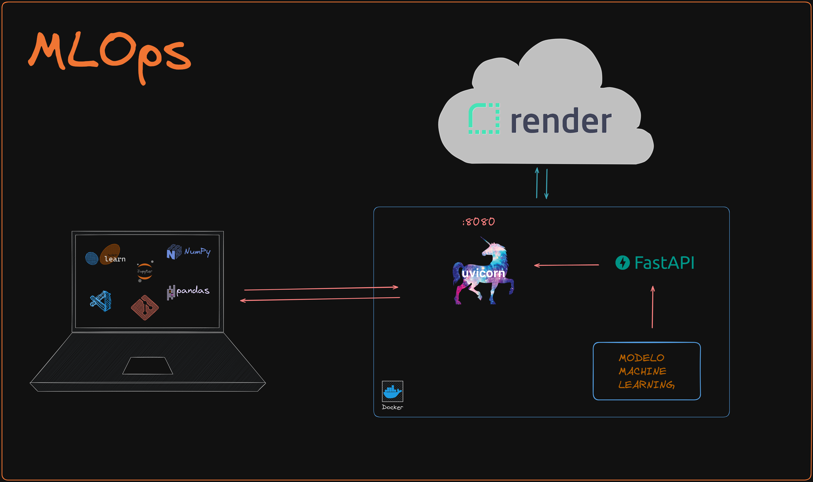

<p align="center">

</p>

_Fuente: Elaboración propia_

<h1 align="center"> Proyecto MLOps de Steam </h1>

## Contenido

A continuación se lista el contenido de este proyecto.

- [Introducción](#introducción)
- [Descripción del Problema](#descripción-del-problema)
- [Información](#información-dataset)
- [Ingeniería de datos](#ingeniería-de-datos)
- [Análisis Exploratorio de Datos (EDA)](#análisis-exploratorio-de-datos-eda)
- [Feature Engineering)](#feature-engineering)
- [Desarrollo de la API](#desarrollo-de-la-api)
- [Modelo de Recomendación](modelo-de-aprendizaje-automático)
- [Deploy en Render](#deploy-en-render)
- [Video](#video)
- [Conclusión](#conclusión)
- [Tecnologías utilizadas](#tecnologías-utilizadas)

## Introducción

En este proyecto, se desarrollará el rol de un Ingeniero MLOps en Steam (plataforma de juegos). El objetivo principal es crear un sistema de recomendación de videojuegos utilizando técnicas de Machine Learning. Los datos necesitan un respectivo tratamiento (ETL, EDA), y la tarea es transformarlos para disponer de ellos y desarrollar un Producto Mínimo Viable (MVP) que luego sea desplegado como una API.

## Descripción del Problema

Es necesario crear un modelo de aprendizaje automático para un sistema de recomendación de videojuegos. El estado actual de los datos es crudo y no procesado. Nuestro objetivo es empezar desde cero, realizar tareas rápidas de Ingeniería de Datos y entregar un MVP al final del proyecto.

## Información dataset

En este proyecto, Se trabajó con tres archivos JSON que contienen datos acerca de los juegos en la plataforma Steam:

- `steam_games.json.gz`

  Este conjunto de datos  proporciona las características principales de cada juego, incluye información vital como títulos, desarrolladores, precios, géneros y etiquetas.

- `users_reviews.json.gz`
  
  Este conjunto de datos presenta opiniones de usuarios sobre los juegos que han adquirido. Contiende detalles sobre recomendación de los juegos y conteo sobre la utilidad de los comentarios.

- `users_items.json.gz`
  
  Contiene información de los juegos consumidos y su dedicación a lo largo del tiempo.

Fuente de datos: [Dataset](https://drive.google.com/drive/folders/1HqBG2-sUkz_R3h1dZU5F2uAzpRn7BSpj)  

## Ingeniería de Datos

**Limpieza y Transformación de Datos (ETL):**

- Leer el conjunto de datos en el formato correcto.

- Eliminar columnas innecesarias para optimizar el rendimiento de la API y el entrenamiento del modelo.
- En la siguiente tabla se muestra la ubicación del ETL realizado.

| Dataset           | Ubicación                                                |
|---------------|----------------------------------------------------------|
| steam_games   | [ETL Games](https://github.com/Ivan2125/MLOps-Steam/blob/main/01-etl-games.ipynb)         |
| user_items    | [ETL Reviews](https://github.com/Ivan2125/MLOps-Steam/blob/main/02-etl-reviews.ipynb)      |
| user_reviews  | [ETL Items](https://github.com/Ivan2125/MLOps-Steam/blob/main/03-etl-items.ipynb)         |

**Análisis de Sentimiento:**
Crear una nueva columna, 'sentiment_analysis', aplicando análisis de sentimiento mediante Procesamiento de Lenguaje Natural (NLP) a las reseñas de usuarios. La escala que se utilizo fue: '0' para comentarios negativos, '1' para neutrales y '2' para positivos.

## Análisis Exploratorio de Datos (EDA)

**Exploración Manual:**
Realizar un EDA manual después del ETL para investigar las relaciones entre variables, identificar valores atípicos y descubrir patrones interesantes dentro del conjunto de datos, para esta tarea se utilizan diferentes librerías para hacer visualizaciones y medidas estadísticas. ["EDA"](02_EDA.ipynb)

## Feature Engineering

**Creación de DataFrames Auxiliares:** Antes de desarrollar las funciones de la API, se crearon DataFrames auxiliares para optimizar el espacio y mejorar el rendimiento de las funciones. Estos DataFrames se utilizaron para almacenar datos específicos necesarios para las consultas de la API. En la siguiente tabla se muestran los datasets creados:

| Nombre                            | Archivo                               |
|-----------------------------------|---------------------------------------|
| gasto_items                       | 04-gasto-items.parquet                |
| ranking_genero                    | 05-ranking-genero.parquet             |
| tiempo_juego_genero               | 06-tiempo-juego-genero.parquet        |
| items_developer                   | 07-items-developer.parquet            |
| user_time_year                    | 08-user-time-year.parquet             |
| top_dev                           | 09-top-dev.parquet                    |

Los datasets se encuentran en  la siguiente carpeta [data](https://github.com/Ivan2125/MLOps-Steam/tree/main/data)

## Desarrollo de la API

**Framework:** Utilizar el framework FastAPI para exponer los datos de la empresa a través de endpoints RESTful.

**Endpoints (funciones objetivo):**

- `developer(desarrollador : str)`: Cantidad de items y porcentaje de contenido Free por año según empresa desarrolladora.

- `userData(user_id : str)`: Debe devolver cantidad de dinero gastado por el usuario, el porcentaje de recomendación en base a reviews.recommend y cantidad de items.

- `userForGenre(genero : str)`: Debe devolver el usuario que acumula más horas jugadas para el género dado y una lista de la acumulación de horas jugadas por año de lanzamiento.

- `bestDeveloperYear(año : int)`: Devuelve el top 3 de desarrolladores con juegos MÁS recomendados por usuarios para el año dado. (reviews.recommend = True y comentarios positivos)

- `developerReviewsAnalysis(desarrollador : str)`: Según el desarrollador, se devuelve un diccionario con el nombre del desarrollador como llave y una lista con la cantidad total de registros de reseñas de usuarios que se encuentren categorizados con un análisis de sentimiento como valor positivo o negativo.

Dentro de la carpeta [/data](https://github.com/Ivan2125/MLOps-Steam/tree/main/data) se encuentran los dataframes utilizados para cada función y en el siguiente enlace se encuentran las funciones documentadas antes de la creación de la API FastAPI: [Funciones API](https://github.com/Ivan2125/MLOps-Steam/blob/main/06-api-funciones.ipynb)

En caso de querer ejecutar la API desde localHost se deben seguir los siguientes pasos:

- Clonar el proyecto haciendo

  ```bash
  git clone https://github.com/Ivan2125/MLOps-Steam.git
  ```

- Preparación del entorno de trabajo en Visual Studio Code:

  - Crear entorno

    ```bash
     python -m venv env
     ```

  - Ingresar al entorno haciendo

    ```bash
    source env\Scripts\activate
    ```
  
  - Instalar dependencias con
  
    ```bash
    pip install -r requirements.txt
    ```

- Ejecutar el archivo main.py desde consola activando uvicorn. Para ello, hacer
  
    ```bash
    uvicorn main:app --reload
    ```

- Hacer Ctrl + clic sobre la dirección `http://XXX.X.X.X:XXXX` (se muestra en la consola).
- Una vez en el navegador, dar click en  `Consulta API` para acceder a la API.
- En cada una de las funciones hacer clic en `Try it out` y luego introducir el dato que requiera o utilizar los ejemplos por defecto. Finalmente Ejecutar y observar la respuesta.

## Modelo de Recomendación

**Sistema de Recomendación:** Se implementa un sistema de recomendación de filtrado colaborativo item-item. En este caso el sistema de recomendación funciona tomando un item (juego) y encontrando cinco similares a este. Para poder lograr desplegar(deploy) el modelo con espacio de memoria limitado se utiliza la técnica de muestreo, esto significa que se usa solo una muestra de los datos para realizar la recomendación aunque esto puede conllevar a predicciones no tan precisas.

| Nombre                            | Archivo                               |
|-----------------------------------|---------------------------------------|
| Modelo de recomendación                       | 04-gasto-items.parquet    |

**Integración con la API:** Se aseguró que las recomendaciones del modelo puedan accederse a través de un endpoint API GET/POST, como `recomendacionJuego(item : str)`.

### Deploy en Render

Para el deploy de la API se seleccionó la plataforma Render que es una nube unificada para crear y ejecutar aplicaciones y sitios web, permitiendo el despliegue automático desde GitHub. Para esto se siguieron estos pasos:

- Generación de un Dockerfile cuya imagen es Python 3.11.8. Se puede ver el detalle del documento [Dockerfile](https://github.com/Ivan2125/MLOps-Steam/blob/main/Dockerfile).
- Se generó un servicio nuevo  en `render.com`, conectado al presente repositorio y utilizando Docker como Runtime.
- Finalmente, el servicio queda corriendo en [https://repo-deploy.onrender.com](https://pi1-games.onrender.com/).

Para el despliegue automático, Render utiliza GitHub y dado que el servicio gratuito cuenta con una limitada capacidad de almacenamiento, se realizó un repositorio exclusivo para el deploy, el cual se encuentra [aquí](https://github.com/Ivan2125/repo-Deploy).

## Video

En este [link](https://drive.google.com/drive/folders/1Rtn0s5jHaqRaQkGpb4OSYTS4BpvOW-oF?usp=drive_link) se encuentra el video donde se explica brevemente el desarrollo del proyecto y el correcto funcionamiento de la API desplegada en el servicio web de Render.

## Conclusión

El presente proyecto de MLOps logró transformar datos de juegos en bruto en un sistema funcional de recomendación desplegado en un servicio web como una API de consulta. La optimización del espacio mediante datasets auxiliares es una estrategia clave para mejorar el rendimiento de las funciones al igual que utilizar el muestreo en el modelo de recomendación. Al abordar la ingeniería de datos, el desarrollo de la API, el EDA y el aprendizaje automático, se cumplió con el objetivo de proporcionar recomendaciones acerca de los juegos presentes en la plataforma de Steam.

## Tecnologías Utilizadas

En el desarrollo de este proyecto, aprovechamos varias tecnologías para llevar a cabo las distintas etapas del proceso:


